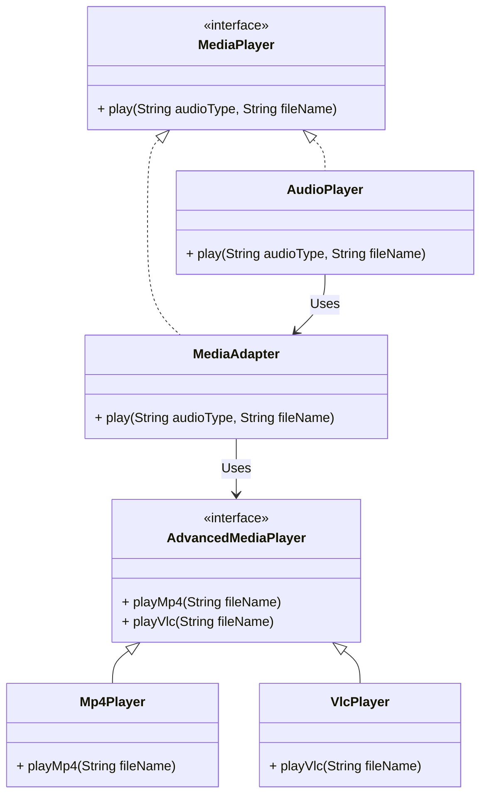

# **Adapter Design Pattern in Java**

## **🔹 Purpose**
The **Adapter Pattern** is a **structural design pattern** that allows incompatible interfaces to work together. It acts as a **bridge** between two incompatible interfaces by converting one interface into another expected by the client.

---

## **🔹 When to Use Adapter Pattern?**
✅ When you need to **integrate old (legacy) code** with a new system without modifying existing code.  
✅ When two classes have **incompatible interfaces**, but you need them to work together.  
✅ When you want to **reuse third-party or legacy code** without modifying it.  

---

## **🔹 Real-World Example**
Consider a **mobile charger adapter**:  
- The **wall socket** provides **AC power**, but the **phone requires DC power**.  
- The **charger (adapter)** converts AC to DC, making them compatible.

---

## **🔹 Java Example: Media Player Adapter**
Imagine we have a **Media Player** that can play only **MP3 files**, but we want it to support **MP4 and VLC formats** without modifying the existing `AudioPlayer` class.

#### **1️⃣ Create the Target Interface**
```java
// Target Interface
interface MediaPlayer {
    void play(String audioType, String fileName);
}
```
This interface is expected by the client (`AudioPlayer`).

---

#### **2️⃣ Create an Advanced Media Player for New Formats**
```java
// Adaptee Interface (Incompatible Interface)
interface AdvancedMediaPlayer {
    void playMp4(String fileName);
    void playVlc(String fileName);
}

// Concrete class to play MP4 files
class Mp4Player implements AdvancedMediaPlayer {
    public void playMp4(String fileName) {
        System.out.println("Playing MP4 file: " + fileName);
    }

    public void playVlc(String fileName) { 
        // Do nothing, as Mp4Player does not support VLC format
    }
}

// Concrete class to play VLC files
class VlcPlayer implements AdvancedMediaPlayer {
    public void playMp4(String fileName) { 
        // Do nothing, as VlcPlayer does not support MP4 format
    }

    public void playVlc(String fileName) {
        System.out.println("Playing VLC file: " + fileName);
    }
}
```
- **Mp4Player** and **VlcPlayer** are new media players but they **do not implement `MediaPlayer`**, so they are incompatible with the `AudioPlayer`.

---

#### **3️⃣ Create the Adapter Class**
```java
// Adapter Class (Acts as a Bridge)
class MediaAdapter implements MediaPlayer {
    private AdvancedMediaPlayer advancedMediaPlayer;

    // Constructor: Choose the correct player based on file type
    public MediaAdapter(String audioType) {
        if (audioType.equalsIgnoreCase("mp4")) {
            advancedMediaPlayer = new Mp4Player();
        } else if (audioType.equalsIgnoreCase("vlc")) {
            advancedMediaPlayer = new VlcPlayer();
        }
    }

    // Convert MediaPlayer request to AdvancedMediaPlayer format
    public void play(String audioType, String fileName) {
        if (audioType.equalsIgnoreCase("mp4")) {
            advancedMediaPlayer.playMp4(fileName);
        } else if (audioType.equalsIgnoreCase("vlc")) {
            advancedMediaPlayer.playVlc(fileName);
        }
    }
}
```
- `MediaAdapter` implements `MediaPlayer`, so it **matches the expected interface**.
- It **delegates** requests to the appropriate `AdvancedMediaPlayer` (either `Mp4Player` or `VlcPlayer`).

---

#### **4️⃣ Create the AudioPlayer (Client)**
```java
// Client Class
class AudioPlayer implements MediaPlayer {
    private MediaAdapter mediaAdapter;

    public void play(String audioType, String fileName) {
        if (audioType.equalsIgnoreCase("mp3")) {
            System.out.println("Playing MP3 file: " + fileName);
        } else if (audioType.equalsIgnoreCase("mp4") || audioType.equalsIgnoreCase("vlc")) {
            mediaAdapter = new MediaAdapter(audioType);
            mediaAdapter.play(audioType, fileName);
        } else {
            System.out.println("Invalid media type: " + audioType);
        }
    }
}
```
- `AudioPlayer` originally supports **only MP3**.
- For **MP4 and VLC**, it **delegates playback to `MediaAdapter`**.

---

#### **5️⃣ Test the Adapter Pattern**
```java
public class AdapterPatternDemo {
    public static void main(String[] args) {
        AudioPlayer audioPlayer = new AudioPlayer();

        audioPlayer.play("mp3", "song.mp3");
        audioPlayer.play("mp4", "video.mp4");
        audioPlayer.play("vlc", "movie.vlc");
        audioPlayer.play("avi", "unsupported.avi"); // Invalid type
    }
}
```

---

#### **6️⃣ Output**
```
Playing MP3 file: song.mp3
Playing MP4 file: video.mp4
Playing VLC file: movie.vlc
Invalid media type: avi
```

---

#### **🔹 UML Class Diagram (Mermaid)**


---

#### **🔹 Key Features of Adapter Pattern**
| Feature | Explanation |
|---------|------------|
| **Bridges Incompatible Interfaces** | Converts one interface into another expected by the client. |
| **Follows Single Responsibility Principle (SRP)** | `AudioPlayer` doesn’t need to handle different formats. |
| **Follows Open/Closed Principle (OCP)** | We can add new formats (e.g., AVI) without modifying existing code. |
| **Used for Legacy Code** | Helps integrate old and new systems without modifying old code. |

---

#### **🔹 When to Use the Adapter Pattern?**
✅ When you have **legacy code** that needs to work with new systems.  
✅ When two classes have **incompatible interfaces**, but you need them to communicate.  
✅ When you want to **reuse third-party libraries** that don’t match your expected interface.  

---

#### **🔹 Real-World Examples**
| Example | Description |
|---------|------------|
| **Power Adapter** | Converts **110V to 220V** for different electrical devices. |
| **Java I/O Streams** | `InputStreamReader` acts as an **adapter** between `InputStream` (byte stream) and `Reader` (character stream). |
| **JDBC Driver** | `JDBC Driver` acts as an **adapter** between Java and different databases like MySQL, PostgreSQL. |

---

#### **📌 Conclusion**
- The **Adapter Pattern** acts as a **bridge** between incompatible interfaces.  
- It **reuses existing classes** without modifying them.  
- It is **widely used** in **legacy code integration**, **third-party libraries**, and **Java I/O systems**.  

---