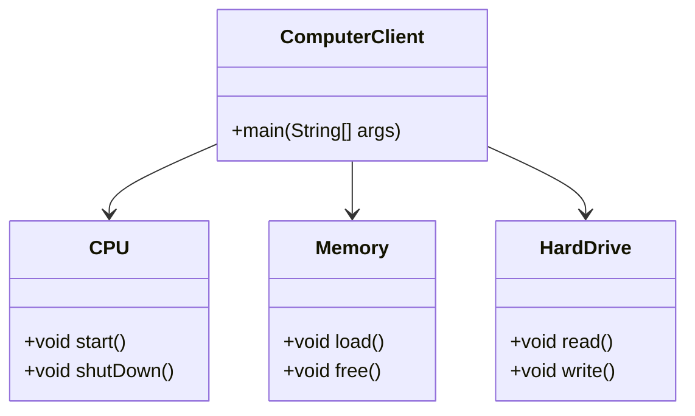
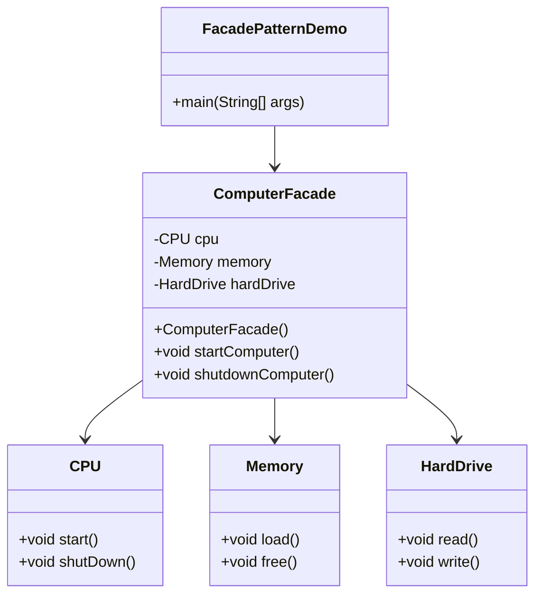

# Facade Design Pattern

`The Facade Pattern is a structural design pattern that provides a simplified interface to a complex system of classes, libraries, or APIs.`

### **Where / When to Use It?**
- When you have a **complex system** with many interacting parts, and you want to **simplify access** for the client.
- When you want to **decouple clients** from complex subsystems.
- When you want to provide a **unified interface** to multiple classes.

---

### **Real-World Example**
Think of a **home theater system**. You have multiple components like:
- **DVD Player**
- **Projector**
- **Sound System**
- **Lights**

Instead of controlling each separately, you can have a **single remote (Facade)** that turns everything ON/OFF with one button.

#### **Without Facade (Complex for Client)**

##### **Problem?**
The client has to know **all the steps** to start and shut down the computer. This makes it difficult to use and maintain.

#### **Using Facade Pattern (Simplified for Client)**
We create a **Facade (ComputerFacade)** to **hide** the complexity.

---

### **Advantages of Facade Pattern**
✅ **Simplifies Usage** → The client interacts with just one class instead of multiple subsystems.  
✅ **Encapsulates Complexity** → Hides the details of the subsystem from the client.  
✅ **Reduces Dependencies** → Changes in the subsystem don't affect the client.  
✅ **Improves Code Readability & Maintainability** → Clear separation of concerns.  

## **Disadvantages of Facade Pattern**
❌ **Limited Functionality** → If the client needs more advanced control, it may have to bypass the facade.  
❌ **Potential Performance Overhead** → The extra abstraction layer may introduce a slight performance cost.  

---

### **Conclusion**
The **Facade Pattern** is useful when dealing with **complex systems** by providing a **simple interface** for clients. It improves code readability, maintainability, and reduces dependencies. However, it may limit flexibility if the client needs full control over subsystems.