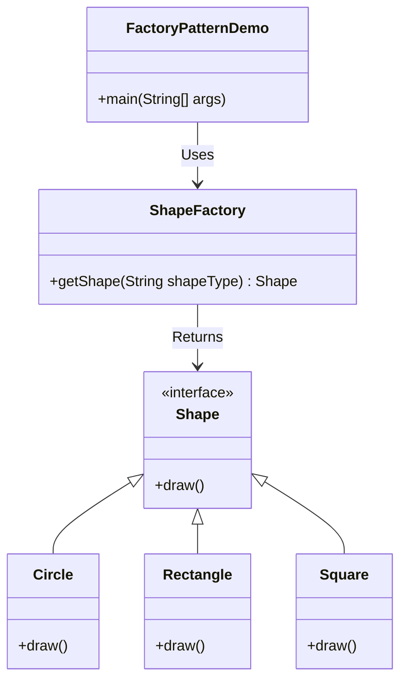

# **Factory Design Pattern in Java**

### **Purpose:**
The **Factory Design Pattern** is a **creational** design pattern that provides an interface for creating objects without specifying their exact class. Instead of directly using the `new` keyword, we delegate the object creation to a factory method.

### **When to Use Factory Pattern?**
- When we have a **superclass** with multiple **subclasses**, and we want to **instantiate the appropriate subclass** dynamically.
- When the **object creation logic is complex** and should be separated from client code.
- When we **don’t want to expose the instantiation logic** to the client.

---

## **Implementation Steps**
1. **Create an interface (or abstract class)** defining a contract for objects.
2. **Create multiple concrete classes** implementing that interface.
3. **Create a Factory class** with a method that returns an instance based on input.
4. **Use the Factory class** instead of directly instantiating objects with `new`.

---

## **Example: Shape Factory**

---

## **Advantages of Factory Pattern**
✅ **Encapsulation**: Hides the object creation logic from the client.  
✅ **Flexibility**: Easily add new object types without modifying existing code.  
✅ **Loose Coupling**: The client doesn’t need to know which class it is using.  

## **Disadvantages of Factory Pattern**
❌ **Increases Complexity**: Adds an extra layer of abstraction.  
❌ **Performance Overhead**: In simple cases, using `new` directly is more efficient.  

---

## **Real-World Examples of Factory Pattern**
1. **Java Collections Framework**  
   - `List<String> list = ArrayListFactory.create();` (instead of `new ArrayList<>()`)
2. **Database Connection**  
   - `Connection conn = DriverManager.getConnection(url, user, password);`
3. **Logging Frameworks**  
   - `Logger logger = LoggerFactory.getLogger(YourClass.class);`

---

### **Conclusion**
The **Factory Pattern** is a powerful tool when working with multiple subclasses and object creation logic that can change frequently. It makes the code **more maintainable** and **scalable**.