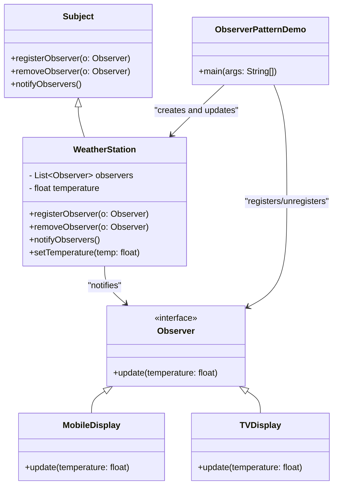

## **Observer Design Pattern**
The **Observer Design Pattern** is like a **YouTube subscription system**.

1. You (Observer) **subscribe** to a YouTube channel (Subject).
2. When the YouTuber uploads a new video, **all subscribers get notified** automatically.
3. If you **unsubscribe**, you won’t get updates anymore.

> Observer pattern is used when **one object (the Subject) needs to notify multiple other objects (Observers) about changes automatically**.

### **When to Use Observer Pattern?**
✅ **Use it when:**
- You need to notify multiple objects when one object changes.
- You want to achieve a **loosely coupled system** (Observers don’t need to know details about the Subject).
- You need a **publish-subscribe mechanism**.

🚫 **Avoid if:**
- Too many observers slow down performance.
- Notifications are not required.

---
### **Key Takeaways**
✅ **Loose Coupling:** The WeatherStation (Subject) doesn’t need to know details about observers.  
✅ **Automatic Updates:** No need for observers to manually check for updates.  
✅ **Multiple Listeners:** Many observers can react to the same event.

---
## Class Diagram

