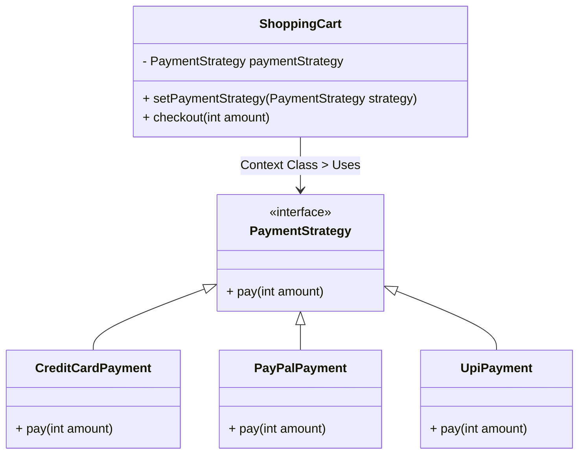

# **Strategy Design Pattern**

## **Purpose**
The **Strategy Pattern** is a **behavioral design pattern** that allows us to define a family of algorithms, encapsulate them in separate classes, and make them interchangeable at runtime.

### **When to Use Strategy Pattern?**
✅ When we have **multiple variations of an algorithm** and want to choose one dynamically.  
✅ When we **avoid using multiple `if-else` or `switch` statements** for different behaviors.  
✅ When we want to **allow new behaviors (algorithms) to be added easily** without modifying existing code.  

## **Example: Payment System**

Let's say we are implementing a shopping cart where a user can choose **different payment methods** (Credit Card, PayPal, UPI). Instead of hardcoding the payment logic, we use the **Strategy Pattern** to define different payment strategies.

## **Step-by-Step Implementation in Java**

**Step 1: Define the Strategy Interface**
This interface defines a contract for all payment methods.
**Step 2: Implement Different Payment Strategies**
Each payment method has its own implementation of `pay()`.
**Step 3: Create a Context Class**
- The `ShoppingCart` class holds a reference to a **PaymentStrategy**.
- The client can **set the payment method dynamically** using `setPaymentStrategy()`.
- The `checkout()` method **delegates the payment to the selected strategy**.




## **Key Features of Strategy Pattern**
| Feature | Explanation |
|---------|------------|
| **Encapsulation of Algorithms** | Each algorithm (payment method) is in its own class. |
| **Interchangeable Behavior** | The payment method can be changed at runtime. |
| **Eliminates `if-else` statements** | Instead of `if (paymentType == "credit")`, we just call `pay()`. |
| **Open/Closed Principle** | New strategies (e.g., Google Pay, Apple Pay) can be added without modifying existing code. |

## **Real-World Examples of Strategy Pattern**
1. **Sorting Algorithms in Java Collections**
   ```java
   Collections.sort(list, new Comparator<T>() { ... });
   ```
   Different sorting strategies can be applied dynamically.
   
2. **Authentication Strategies**
   - Logging in using **Google, Facebook, or Email**.

3. **Compression Algorithms**
   - Choosing between **ZIP, RAR, or GZIP** for file compression.

### **Conclusion**
The **Strategy Pattern** is useful when we need to switch between multiple behaviors (algorithms) dynamically. It helps in writing **clean, maintainable, and scalable code**.

---
### **Difference Between Factory and Strategy Design Patterns**

#### **🔹 Key Differences:**
| Feature | Factory Pattern | Strategy Pattern |
|---------|----------------|-----------------|
| **Purpose** | Creates objects without exposing instantiation logic to the client. | Defines a family of algorithms and allows selecting one at runtime. |
| **Pattern Type** | **Creational** (focused on object creation). | **Behavioral** (focused on changing behavior dynamically). |
| **How it Works?** | Encapsulates object creation logic inside a factory class. | Encapsulates different algorithms/behaviors inside separate classes. |
| **Used When?** | When object creation logic is complex and should be centralized. | When multiple behaviors exist and can be swapped dynamically. |
| **Key Concept** | The client requests an object from a factory instead of using `new`. | The client selects an algorithm (strategy) at runtime. |
| **Example Scenario** | Creating different types of database connections (MySQL, PostgreSQL, Oracle). | Choosing different payment methods (Credit Card, PayPal, UPI). |
| **Code Structure** | Has a factory class with a method that returns different objects. | Has a context class that holds a reference to a strategy interface. |
| **Flexibility** | New products (subclasses) can be added without modifying client code. | New strategies (algorithms) can be added without modifying the context class. |


#### **🔹 When to Use Which?**
| **Use Factory Pattern When…** | **Use Strategy Pattern When…** |
|------------------------------|-------------------------------|
| You need a centralized way to **create objects**. | You need to **switch between multiple behaviors dynamically**. |
| Object creation logic is **complex** and should be hidden. | You want to **avoid long if-else chains** for different algorithms. |
| Adding new types of objects should not require changing client code. | Adding new behaviors should not require modifying existing classes. |

#### **🔹 Real-World Examples**
| Pattern | Real-World Example |
|---------|--------------------|
| **Factory Pattern** | `Connection conn = DriverManager.getConnection(url, user, pass);` (JDBC Factory) |
| **Strategy Pattern** | `Collections.sort(list, Comparator)` (Sorting strategies in Java Collections) |

#### **🔹 Conclusion**
- The **Factory Pattern** helps with **object creation**.
- The **Strategy Pattern** helps with **algorithm selection at runtime**.
- Both follow **Open/Closed Principle** (OCP), making them **flexible and extensible**.
